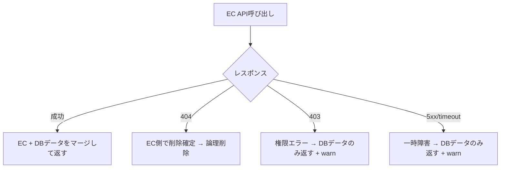

## EC API障害で注文データが消えた

ある日、EC連携先のAPIが一時的に403を返しました。

それだけなら「あー、また一時障害か」で済む話なんですが、問題はその後です。**注文データが論理削除されてました**。APIが復旧しても、DB上では「削除済み」になってるのでユーザーからは「注文が消えた」ように見えます。

原因を調べたら、エラーの種類を区別せずに一律で「EC側に存在しない = 削除」と判断するロジックになってたんですよね。403（権限エラー）も404（存在しない）も同じ扱いでした。

これをきっかけに、エラーハンドリングの設計を根本から見直すことにしました。

## エラーを3つに分類する

まず、すべてのエラーを3種類に分けるところから始めました。

| 分類 | gRPCコード | どうするか |
|------|-----------|-----------|
| **業務エラー** | FailedPrecondition | ユーザーに伝える（バリデーション失敗等） |
| **一時エラー** | Unavailable, DeadlineExceeded | リトライ or フォールバック |
| **システムエラー** | Internal | 開発者が対応（バグ） |

この分類に合わせて、AppErrorというラッパーを全サービスに導入しました。エラーを返すときは必ずこのラッパーを通すようにしています。

```go
type AppError struct {
    Code    codes.Code
    Message string
    Err     error
}

func NewBusinessError(msg string, err error) *AppError {
    return &AppError{Code: codes.FailedPrecondition, Message: msg, Err: err}
}

func NewTransientError(msg string, err error) *AppError {
    return &AppError{Code: codes.Unavailable, Message: msg, Err: err}
}
```

## フォールバック戦略を設計する

注文サービスの設計を大きく変えました。ポイントは「外部APIは必ず壊れる前提」で設計することです。

### 判断フロー



修正前は403も404もまとめて「ECに存在しない」扱いだったのを、ステータスコードごとに振る舞いを分けました。

**修正前** — エラーの種類を区別しない:

```go
orders, err := ecClient.GetOrders(ctx, storeID)
if err != nil {
    // 全エラーで論理削除が走る
    return u.repo.SoftDeleteByStoreID(ctx, storeID)
}
```

**修正後** — エラーの種類で振る舞いを変える:

```go
orders, err := ecClient.GetOrders(ctx, storeID)
if err != nil {
    if errors.Is(err, domain.ErrNotFound) {
        return u.repo.SoftDeleteByStoreID(ctx, storeID)
    }
    // 403や5xxはDBのデータをフォールバックとして返す
    logger.Warn("ec api failed, fallback to db", "error", err)
    return u.repo.FindByStoreID(ctx, storeID)
}
```

## レートリミット対策

大量注文の取り込みで、EC APIのレートリミット（429）に引っかかる問題もありました。

やったことはシンプルです。

- ページネーションの間にウェイトを入れる
- 同期処理にクールダウン期間を設ける
- `context.WithoutCancel`で、gRPCのタイムアウトに引きずられないようにする

地味ですが、「API側の都合」と「自システムの都合」を分離するのが大事でした。

## ユーザーへのエラー伝播

バックエンドでエラーを分類しても、フロントエンドでの見せ方がイマイチだと意味がありません。

外部の配送APIや決済APIのエラーメッセージがそのままユーザーに表示されてた問題があったので、gRPCコードに応じて表示を分けるようにしました。

| gRPCコード | フロントの表示 |
|------------|---------------|
| FailedPrecondition | 具体的なエラーメッセージをバナー表示 |
| Internal | 「エラーが発生しました」（汎用） |
| Unavailable | 「しばらくしてからもう一度お試しください」 |

決済サービスの場合はさらに細かく、エラーコード別にユーザーフレンドリーなメッセージへ変換しています。「カード番号が正しくありません」「有効期限が切れています」みたいな感じですね。

## リトライの設計

外部の配送APIで一時障害が起きたとき、リトライを入れるかどうかも議論になりました。

結論としては、Envoy（サービスメッシュ）のリトライとアプリケーション層のリトライの責務を分けることにしました。

- **Envoy**: サービス間通信のリトライ（ネットワークレベル）
- **アプリケーション**: 外部API呼び出しのリトライ（ビジネスロジックレベル）

本当にリトライされてるかは`x-envoy-attempt-count`ヘッダーをログに出して検証しています。「リトライ入れました」で終わりにせず、ちゃんと動いてるか確認するのが大事です。

## おわりに

エラーハンドリングって「例外を握りつぶす」ことじゃなくて、「エラーが起きたときのシステムの振る舞いを設計する」ことなんですよね。

今回学んだことをまとめると:

- 外部APIは必ず壊れる前提で設計する
- エラーの分類 → 各分類への対処方針 → 実装、の順番が大事
- 「ユーザーに何を見せるか」まで含めてエラーハンドリング

403で注文が消えた事件は結構衝撃でしたが、おかげでエラーハンドリングの設計を根本から見直すきっかけになりました！
