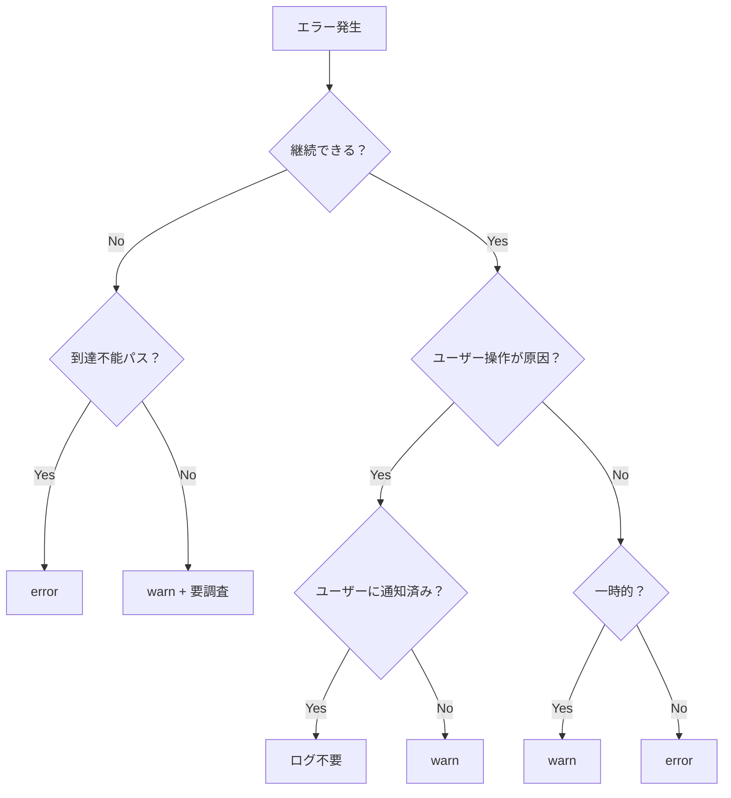

## 本番のERRORログ、85%がノイズでした

ある日ふと本番のログダッシュボードを開いたら、ERRORログが毎分数百件流れてました。

「え、障害起きてる？」と思って確認したんですが、アラートも鳴ってないし、ユーザーからの問い合わせもゼロ。落ち着いてログの中身を見てみたら、こんなのがずらっと並んでました。

- `ErrNotFound` — レコードがないだけ
- パスワード間違い — ユーザーの操作ミス
- 外部APIの一時的な404 — リトライしたら成功してる

全部ERRORで出てるんですよね。14リポジトリ・600コミット以上を積み重ねてきたプロジェクトで、みんなが「とりあえず `logger.Error` 書いとくか」をやり続けた結果でした。

試しに1週間分のログを集めて分類してみました。

| 分類 | 割合 | 具体例 |
|------|------|--------|
| 正常系なのにERROR | 約60% | ErrNotFound、認証エラー（ユーザー操作起因） |
| 一時的なやつ（勝手に直る） | 約25% | 外部APIの一時障害、リトライ成功 |
| 本当にやばいやつ | 約15% | DB接続断、到達不能パス |

85%ノイズです。これだと本当にやばいエラーが来ても気づけません。

## まずルールを決めました

### ログレベルの使い分け

チームで議論して、3レベルの定義を決めました。debugは使わないことにしています。

| レベル | いつ使う | ざっくり言うと |
|--------|----------|----------------|
| **error** | 継続不可能 + 到達不能パス | 人が動かないといけないやつ |
| **warn** | 異常だけど継続できる | 気にはなるけど今すぐじゃないやつ |
| **info** | 正常系の記録 | あとで見返すかもしれないやつ |

### もう1個大事なルール: 誰が出すか

レベルの定義だけだとまだ足りませんでした。ログが重複する問題があったので、出す場所のルールも決めています。

- ログは**発生元で1回だけ**。`err`を`return`するなら呼び出し元では出さない
- `ErrNotFound`は基本ログ不要（正常系なので）
- NotFoundが「やばい」かどうかはUseCase層で判断する

### gRPCコード別の早見表

gRPCベースだったので、ステータスコードごとのログレベルも一覧にしました。レビューでも「この表に従ってる？」で済むので楽です。

| gRPCコード | ログレベル | なぜ |
|------------|-----------|------|
| OK | — | 正常 |
| NotFound | — or warn | UseCase層で判断 |
| InvalidArgument | warn | ユーザーの入力ミス |
| FailedPrecondition | warn | 業務エラー（想定内） |
| Unavailable | warn | 外部が一時的に死んでる |
| Internal | error | バグかシステム障害 |
| DeadlineExceeded | warn | タイムアウト（リトライ対象） |

### 迷ったとき用のフローチャート

それでも「これどっち？」ってなるケースが出てくるので、判断フローも作りました。



## 実際に迷ったケース3選

ルールを決めても「で、これどっち？」ってなる場面は山ほどありました。特にチームで意見が割れた3つを紹介します。

### 未登録ユーザーのリクエスト

最初はerrorにしてたんですが、本番でめちゃくちゃ出て「あっ」ってなりました。

結論はwarnです。未登録リクエスト自体は想定内なので。ただし急増したら攻撃かもしれないから、監視対象としてwarnにしておきます。errorにすると他のエラーが埋もれちゃうんですよね。

### ID直指定でNotFound

「NotFoundはログ不要」って決めたのに、「IDを直接指定してきてNotFoundってセキュリティ的にまずくない？」という声が出ました。

結論としては、一覧検索で0件ヒットはログ不要。でもID直指定のNotFoundはIDOR（不正アクセス）や総当たりの兆候になり得るので、UseCase層でwarnを出すことにしました。同じNotFoundでも文脈で扱いが変わるのがポイントですね。

### 外部配送APIの「配送不可エリア」

外部の配送APIが「この住所には届けられません」を返してきたケースです。

最初ERRORで出してたんですが、冷静に考えるとユーザーが住所を入力した結果なだけで、システムの異常じゃないんですよね。warnに変更しました。

## パイロットから全展開へ

### こう変えました（コード例）

決済サービスでの変更例です。デフォルトの支払い方法を取得するところ。

**修正前** — 未登録ユーザーでも毎回ERRORが飛ぶ:

```go
func (u *PaymentUseCase) GetDefault(ctx context.Context, userID string) (*Payment, error) {
    payment, err := u.repo.FindDefault(ctx, userID)
    if err != nil {
        logger.Error("failed to get default payment", "error", err, "userID", userID)
        return nil, err
    }
    return payment, nil
}
```

**修正後** — NotFoundは正常系として扱う:

```go
func (u *PaymentUseCase) GetDefault(ctx context.Context, userID string) (*Payment, error) {
    payment, err := u.repo.FindDefault(ctx, userID)
    if err != nil {
        if errors.Is(err, domain.ErrNotFound) {
            // 未登録は正常系。ログ不要
            return nil, nil
        }
        logger.Error("failed to get default payment", "error", err, "userID", userID)
        return nil, err
    }
    return payment, nil
}
```

地味な変更に見えますが、これが14サービスの至るところにありました。

### 展開の進め方

いきなり14サービス全部変えるのは無理だし怖いので、こう進めました。

1. まず決済サービス1つだけに適用して1週間様子を見る
2. ERRORログが激減したのを確認
3. 残り13サービスに順番に展開

一番しんどかったのは、各サービスで「このNotFoundは正常？異常？」をドメイン知識のある開発者と1個ずつ確認していく作業です。ルールを配っておしまい、とはいきませんでした。

### 結果

| 指標 | Before | After |
|------|--------|-------|
| ERRORログ/日 | 約12,000件 | 約1,800件（**85%減**） |
| 対応が必要なERROR | ノイズに埋もれて見つからない | すぐわかる |
| オンコール初動 | まずログの選別から | 該当ERRORを直接見に行ける |

## おわりに

やってみて思ったのは、ログ設計って「技術」というより「運用設計」だなということです。

`logger.Error`を`logger.Warn`に変えるだけなら簡単です。でも「このケースは本当にerrorなのか？」を判断するには、そのサービスのドメイン知識が必要になります。ルール表を作って配って終わりじゃなくて、各サービスの文脈に翻訳していく作業が本質でした。

もし同じような状況にあるなら、まず1週間分のERROR/WARNログを全部集めて分類するところから始めてみてください。たぶん同じ光景が見えると思います！
